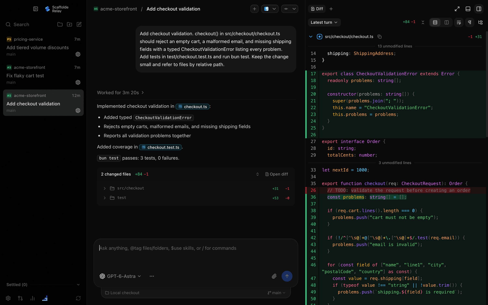
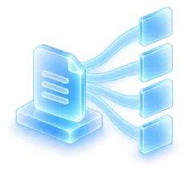
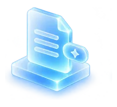
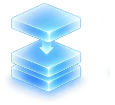
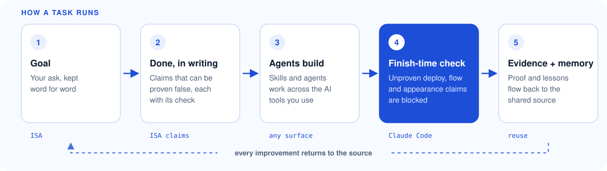

  <picture>
    <source media="(prefers-color-scheme: dark)" srcset="images/brand-mark.webp" />
    <source media="(prefers-color-scheme: light)" srcset="images/brand-mark-light.webp" />
    
  </picture>

<h1 align="center">The best of AI, working as one.</h1>

  <strong>Scaffolde</strong> is the AI operating layer for business. It brings the best models,
  the best agent tools and 187 ready-to-run skills into one system. Capture how your team
  works once, run it in every AI tool you use, and keep every improvement.

  <a href="https://scaffolde.ai"><strong>scaffolde.ai</strong></a> ·
  <a href="https://scaffolde.ai/how-it-works"><strong>How it works</strong></a> ·
  <a href="https://scaffolde.ai/trial"><strong>30-day pilot</strong></a> ·
  <a href="https://scaffolde.ai/investors"><strong>Investors</strong></a>

## Scaffolde Relay

Every agent in one window. Claude and Codex work side by side in their own threads,
with Hermes, OpenClaw and Prime Agent connected, and every change shown as a live diff.

  
   
  <em>A real screenshot of Scaffolde Relay, running on demo data.</em>

## What You Get

<table>
  <tr>
    <td width="50%" valign="top">
      
      <strong>One source feeds every AI tool.</strong> 
      Skills, workflows, agents and rules are written once, then delivered into Claude Code,
      Codex, Hermes, OpenClaw, Prime Agent and more. Improve it in one place and every tool
      gets it.
    </td>
    <td width="50%" valign="top">
      
      <strong>Done is written down before work starts.</strong> 
      Every task keeps your goal word for word, and "done" is written as claims that can be
      proven false, each naming the check that would catch it.
    </td>
  </tr>
  <tr>
    <td width="50%" valign="top">
      
      <strong>Unproven finish claims get blocked.</strong> 
      A finish-time check reads what the agent actually ran and stops "it's deployed" or
      "it works" claims that have no evidence behind them.
    </td>
    <td width="50%" valign="top">
      
      <strong>Every task makes the next one better.</strong> 
      Evidence and lessons flow back into the shared source, so the next task starts from
      everything the last one learned.
    </td>
  </tr>
</table>

## How A Task Runs

  <picture>
    <source media="(prefers-color-scheme: dark)" srcset="images/task-loop-dark.svg" />
    <source media="(prefers-color-scheme: light)" srcset="images/task-loop-light.svg" />
    
  </picture>

## By The Numbers

<table>
  <tr>
    <td align="center"><strong>187</strong> skills</td>
    <td align="center"><strong>243</strong> workflows</td>
    <td align="center"><strong>39</strong> agents</td>
    <td align="center"><strong>13</strong> AI tool surfaces</td>
    <td align="center"><strong>13,757</strong> test cases in the v3.0 release gate, 0 failures</td>
  </tr>
</table>

## Private Preview

The product source stays private during the preview. Scaffolde builds on great open work,
and the credit stays with its authors: [LifeOS](https://github.com/danielmiessler/LifeOS) by Daniel Miessler,
[T3 Code](https://github.com/pingdotgg/t3code) (the base of Relay),
[gstack](https://github.com/garrytan/gstack), [gbrain](https://github.com/garrytan/gbrain),
[hermes-agent](https://github.com/NousResearch/hermes-agent) and
[OpenClaw](https://github.com/openclaw/openclaw).

Scaffolde (spelled with an e) is not Scaffold AI, ScaffoldAI or construction scaffolding.

Contact: [pai@scaffolde.ai](mailto:pai@scaffolde.ai)
